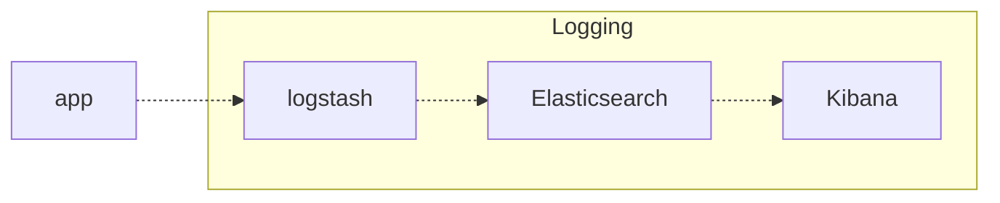

# Demo

Running `docker compose up -d` should run up all the local environment. This includes many services in charge of logging.

## Logstash

https://www.elastic.co/docs/reference/logstash

## ElasticSearch

http://localhost:9200/

## Kibana

https://www.elastic.co/docs/explore-analyze/query-filter

http://localhost:5601/app/home#/
